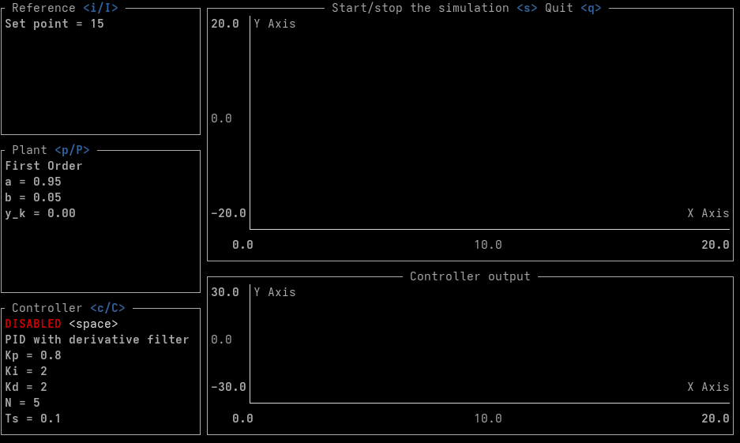

# PID Control Loop Simulator
This is a toy project to simulate a PID control loop in a terminal-based user interface by using [Ratatui](https://github.com/ratatui-org/ratatui).

The simulator provides an interactive TUI where you can:

- Experiment with reference signals (step, sine, square, etc.).
- Choose between different plant models (e.g., first-order, second-order systems).
- Tune PID controller parameters (proportional, integral, derivative gains).
- Observe real-time plots of the reference, plant, and controller output.

The goal is not accuracy or production-grade control, but to visualize how PID controllers behave in different scenarios — directly from your terminal.



## Usage
Install Rust if you haven't already and run the following commands from the terminal:
```bash
# Clone the repository
git clone https://github.com/Ikrk/tui-pid-simulator.git
cd tui-pid-simulator
# Run the simulator
cargo run --release
```

## How to Extend
To add new input, plant, or controller models, add new file to the corresponding directory and implement one of the `Reference`, `Plant`, or `Controller` traits. Register your new model using the `register_reference`, `register_plant`, or `register_controller` macros and finally publish your module in the corresponding mod.rs file.

## ToDos (that may never be completed)
- Allow setting all input signal and plant parameters
- Allow setting sample time
- Show the contribution of each PID term
- Add better support for soft-switching when enabling/disabling the controller
- Allow modifying charts axis settings
- Add support for dynamic axis settings
- Add basic stability analysis tools
- Add additional controllers
- Add controller output capping, antiwindup and other advanced features
